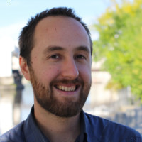

# **The Folk of FreeMoCap**

## **CEO & President: Dr. Jonathan Samir Matthis**

**Dr. Jonathan Samir Matthis** is the Chief Executive Officer, President, and Founder of The FreeMoCap Foundation, as well as the creator of [**The FreeMoCap Project**](https://freemocap.org). Jon founded The FreeMoCap Foundation to support The FreeMoCap Project - and eventually - other projects like it. He is an Assistant Professor of Human Movement Neuroscience in Boston Massachussetts, and has studied the visual control of human movement (particularly locomotion) for more than a decade.

You can find him on [**Twitter**](https://twitter.com/JonMatthis), see his work on [**Google Scholar**](https://scholar.google.com/citations?user=mjYexjAAAAAJ&hl=en), and learn more about him on his [**personal website**](https://jonmatthis.com/)

## **CTO: Endurance Idehen**

Chief Technology Officer, **Endurance Idehen** guides The FreeMoCap Foundation in our promotion of accessible and well-engineered technology. A software craftsman, Endurance has more than a decades worth of experience in Software Engineering. He is currently a Software Architect at [**KUNGFU.AI**](https://www.kungfu.ai/).

You can find him on [**LinkedIn**](https://www.linkedin.com/in/endurance-idehen-63a48338/) and [**GitHub**](https://github.com/endurance)
## **CFO & Treasurer: Ryan Rose, CPA**

Chief Financial Officer and Treasurer, **Ryan Rose** has taken on the vital task of maintaining The FreeMoCap Foundation books. Ryan is the Founder of [**Capital Bookkeeping Cooperative**](https://www.capitalbookkeeping.coop/), an organization that helps small businesses thrive in New York's Capital Region and beyond by providing bookkeeping, accounting, and other business services.

You can find him on [**LinkedIn**](https://www.linkedin.com/in/ry-ro/)

## **COO & Clerk: Dr. Trenton Wirth**

Chief Operations Officer, Clerk, and Co-Founder of The FreeMoCap Foundation, **Dr. Trenton Wirth** endeavors to aid in the day-to-day activities of the Foundation to support its long-term goals. Trent has nearly a decade of experience using Virtual and Augmented Reality to study human perception and action. He is currently a Post-Doctoral Researcher working with Dr. Jonathan Matthis, using Augmented Reality and eye tracking to study the visual control of foot-placement.

You can find him on [**LinkedIn**](https://www.linkedin.com/in/trenton-wirth-1204a8aa/), see his work on [**Google Scholar**](https://scholar.google.com/citations?user=HdJAPMkAAAAJ&hl=en), and learn more about him on his [**personal website**](https://wirthtd.com/)