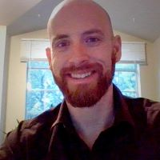
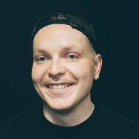
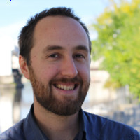

# **The Folk of FreeMoCap**

 

  

    

      
      

        <h2>Dr. Jonathan Samir Matthis</h2>
        
CEO, President, &amp; Founder

        
Jon founded The FreeMoCap Foundation to support The FreeMoCap Project and other projects like it. He is an Assistant Professor of Human Movement Neuroscience in Boston Massachussetts. He runs a <a href="https://scholar.google.com/citations?user=mjYexjAAAAAJ"> scientific research program</a> that investigates the neural control of real-world full-body movement. He has been developing new methodologies to study human movement since 2008 

        <form>
            
<button type="submit" formaction="https://jonmatthis.com" class="button">Personal Website</button>

        </form>
      

    

  

  

    

      
      

        <h2>Dr. Trenton Wirth</h2>
        
COO, Clerk, &amp; Co-Founder

        
As COO, Trent aids in the day-to-day activities of the Foundation to support its long-term goals. Trent has nearly a decade of experience using Virtual and Augmented Reality (AR) to study human perception and action. He is currently a Post-Doctoral Researcher working with Dr. Jonathan Matthis, using AR and eye tracking to study the visual control of foot-placement.

        <form>
            
<button type="submit" formaction="https://wirthtd.com" class="button">Personal Website</button>

        </form>
      

    

  

  

    

      
      

        <h2>Endurance Idehen</h2>
        
CTO

        
Endurance guides The FreeMoCap Foundation in our promotion of accessible and well-engineered technology. A true craftsman, consumate expert, and teacher of teachers, he draws from 10+ years experience as a software engineer, architect, and project leader in the Technology industry. He uses FreeMoCap as a educational working example of the powerful set of principles and 'best practices' that underpin the success of other large scale open source software projects. 

        <form>
            
<button type="submit" formaction="https://www.linkedin.com/in/endurance-idehen-63a48338/" class="button">LinkedIn</button>

        </form>
      

    

  

  

    

      
      

        <h2>Ryan Rose</h2>
        
CFO &amp; Treasurer

        
Ryan steers the financial elements of the FreeMoCap Foundation. Ryan is the Founder of <strong><a href="https://www.capitalbookkeeping.coop/">Capital Bookkeeping</a></strong>, an organization that provides financial services to small businesses  in New York's Capital Region. Inestimable woodsman, homesteader and community leader, Ryan maintains the best practice business infrastructure that allows the FreeMoCap Foundation to grow stably while providing a high level of transparency to our community. 

        <form>
            
<button type="submit" formaction="https://www.linkedin.com/in/ry-ro/" class="button">LinkedIn</button>

        </form>
      

    

  

 
